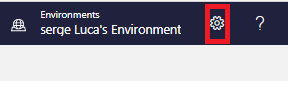
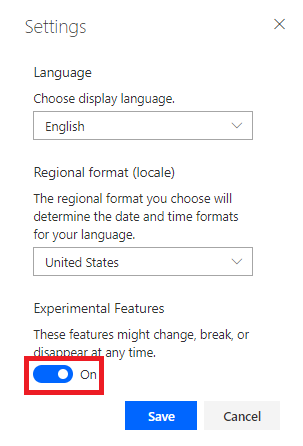
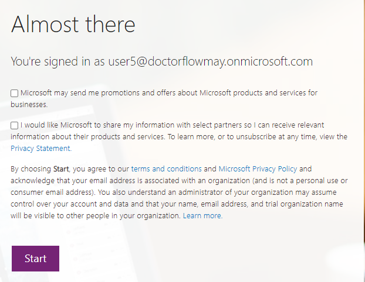

# Lab 0. Setting up the experimental Designer & activate your community licence
## Task: Select the new Power Automate Designer
At the time of writing the new Flow designer is still in experimental stage. To select the new designer,
1.	go to flow.microsoft.com, 
2.	select the settings button:

3.	Select View all Power Automate settings:

4.	Check the option Experimental Features:

 
5.	Click Save.

## Task: Activate your Community license

The Office 365 license provides you with a Standard Power Apps and Power Automate license which is good enough for most labs. However, some labs require a Premium connector; the Community license give you access to Premium features of the product for free. The main restriction with the Community license is that flows, and applications created with the Community license cannot be shared with other users.
Go to https://powerapps.microsoft.com/en-us/communityplan/ and click Get started for free
 

6.	Enter your e-mail address:

7.	And Sign-in:

Click Start:

 

